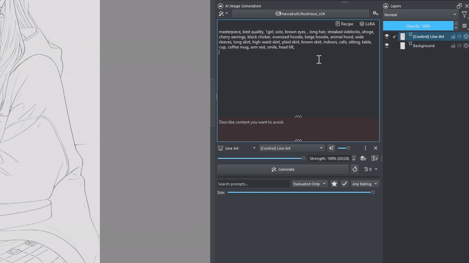
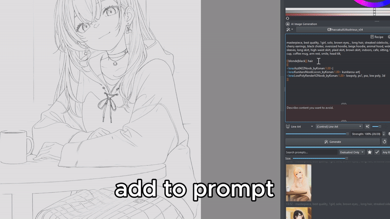
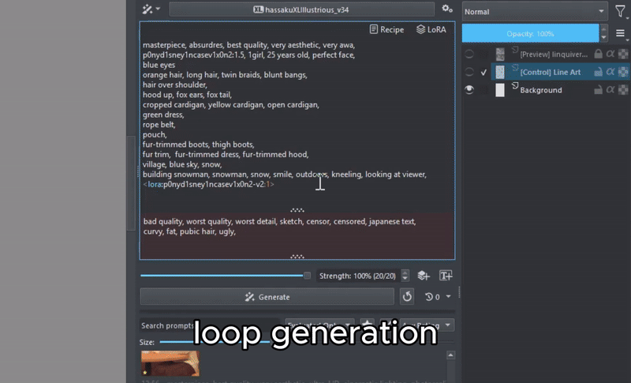
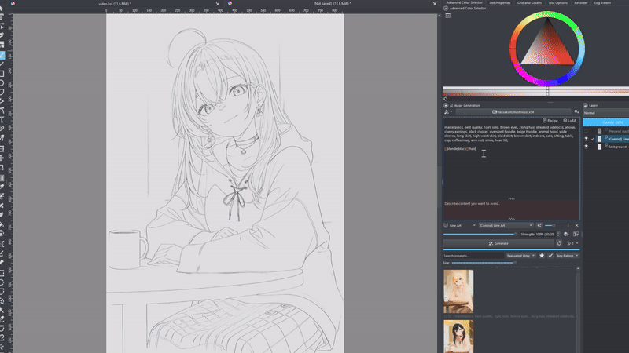
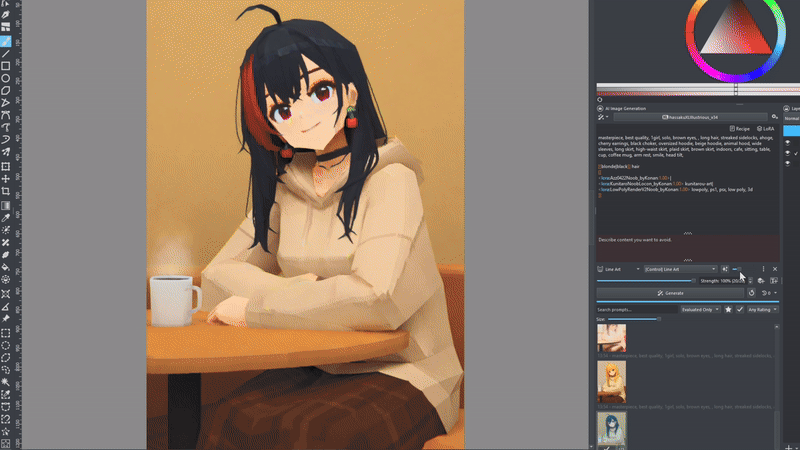
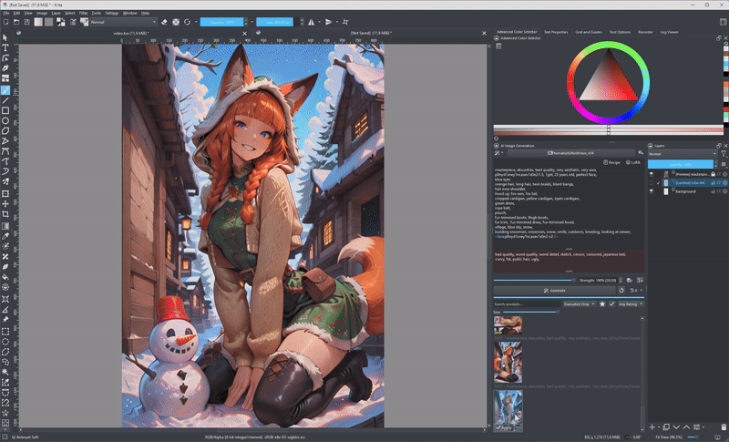
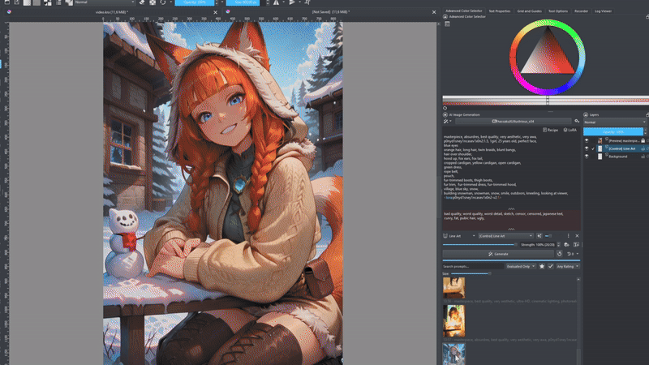
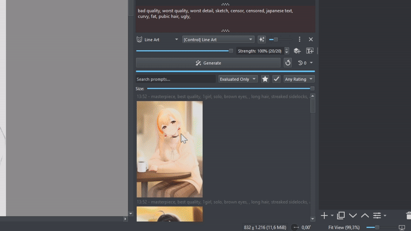
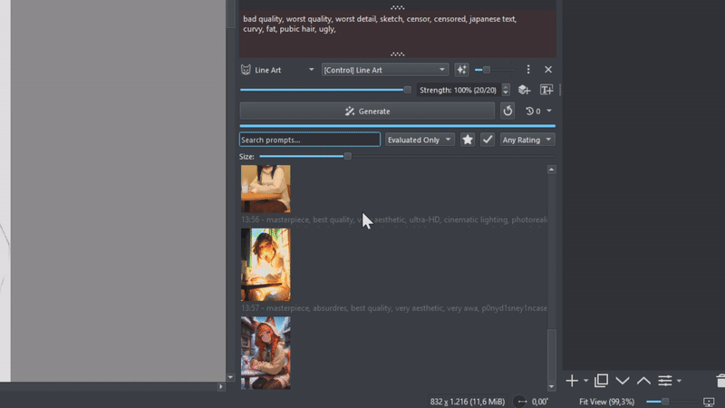
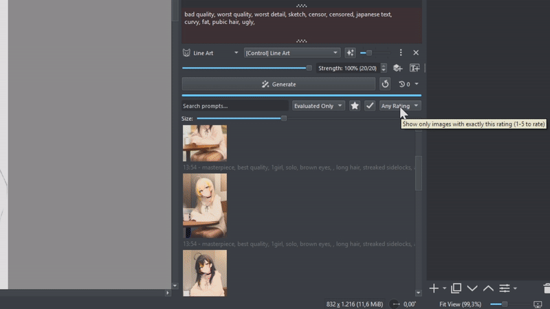

<h1> Generative AI <i>for Krita</i> — UX Edition</h1>

A usability-focused fork of the [Krita AI Diffusion plugin](https://github.com/Acly/krita-ai-diffusion)
with numerous quality-of-life improvements for prompt handling, LoRA management
and batch generation workflows.

All credit for the plugin itself goes to [Acly](https://github.com/Acly) and the
upstream contributors — this fork only layers UX improvements on top and tracks
upstream releases (currently based on v1.53.0).

**This fork is for you if:**

* you work with large LoRA collections and want to browse them visually
  (previews, tags, favorites) instead of memorizing file names
* you generate batches and want systematic control over which prompt/LoRA
  combination each batch item uses
* you want prompt history actions, batch sizing and image export to be less
  clicky and more predictable

## What's different from upstream

### Sequential wildcards & batch control

Upstream only has random wildcards `{a|b|c}`, where each generation picks one
option at random. This fork adds a **sequential** variant using double
brackets: `[[a|b|c]]`. Instead of picking randomly, batch item 1 gets `a`,
item 2 gets `b`, item 3 gets `c`, item 4 wraps back to `a`, and so on — useful
for systematically running through a fixed set of variations instead of
hoping the dice land right.



Multiple `[[...]]` groups in the same prompt combine into a **Cartesian
product** across the whole batch. For example:

```
[[black|white]] cat, [[sitting|jumping]]
```

generates all 4 combinations (black+sitting, black+jumping, white+sitting,
white+jumping) as batch items 1–4, then repeats. A button next to the batch
count (the "a×b" icon) reads the prompt and sets the batch count to
the exact number of combinations for you, so you don't have to count by hand.

`<lora:name:weight>` tags work inside `[[...]]` groups too, and are switched
correctly per batch item — each image in the batch is generated with its own
LoRA set rather than all of them sharing whatever LoRA the first prompt
evaluation picked (which is what happens upstream if you try this).



Other batch changes:
* **Batch count up to 1000** (upstream caps at 10), with a spinbox you can
  type into directly instead of only dragging a tiny slider.
* **Loop Generate**: a toggle button (circular arrow icon) next to Generate.
  Turning it on starts a batch immediately, and every time the queue empties
  it automatically enqueues another one — keeps running unattended (e.g.
  overnight) until you toggle it off again. If generation fails outright
  (bad prompt, disconnected server, etc.) it turns itself back off instead of
  spinning uselessly.

  

### File-based Wildcards

`__name__` in a prompt picks a random line from a `.txt` file in your
`wildcards/` folder (one option per line), matching the convention used by
collections like [sd-wildcards](https://github.com/mattjaybe/sd-wildcards) —
drop such a repo's `wildcards/` folder in directly and it works with no
extra setup. `__folder/name__` addresses a file in a subfolder. A new
**Wildcards** button next to LoRA/Recipe in the prompt toolbar opens a
browser: search, a line-count + preview tooltip per file, a Reload button
for files you just added, and an "Open Folder" button (creates the folder
if it doesn't exist yet).

Three insert modes:
* **Normal** `__name__` — a live reference, re-read from the file and
  picked at random every time you generate. Edit the file later and it
  picks that up automatically.
* **Random** `{a|b|c}` — expands the file's lines directly into the prompt
  as a regular random wildcard group (a frozen snapshot at insert time, no
  live file dependency).
* **Sequential** `[[a|b|c]]` — same expansion, but cycles through every
  line across the batch instead of picking randomly, so you can sweep a
  whole wildcard file systematically in one batch (something a plain
  `__name__` reference can't do, since file wildcards only pick randomly).

Unknown/misspelled `__name__` references are left visible in the evaluated
prompt rather than silently disappearing, so a typo or missing file is easy
to spot instead of just producing a slightly-off image.

### LoRA Browser

Click the **LoRA** button in the prompt field to open a visual LoRA picker
instead of typing `<lora:...>` tags from memory or scrolling a giant
dropdown. It talks to [ComfyUI-Lora-Manager](https://github.com/willmiao/ComfyUI-Lora-Manager)
if you have it installed, and falls back to a plain file-name list otherwise
(no crash, just fewer features — no previews/tags/trigger words).



With Lora Manager available you get:
* **Preview thumbnails** for every LoRA, loaded lazily as you scroll so
  opening the browser with hundreds of LoRAs doesn't stall — including
  **video previews** (first frame extracted via `ffmpeg` if it's on PATH,
  falls back to a play-icon placeholder otherwise)
* **Search** by name, **tag filter** (alphabetical), and a **base-model
  filter** with full names (SD 1.5 / SD XL / Illustrious / Flux Kontext /
  Anima / etc.), matching the labels used in the style editor
* **Favorites**, synced both ways with Lora Manager — right-click a LoRA to
  add/remove it as a favorite from directly inside Krita, no need to switch
  to the Lora Manager web UI
* **Commercial-use badge**: a small $ square in the bottom-right corner of
  each thumbnail — green if CivitAI's license allows commercial use of
  generated images, red if it doesn't, grey if unknown. A gold ★ in the
  top-right marks favorites, and a base-model name tag sits bottom-left.
  Right-click → **Open on CivitAI** jumps straight to the model page.
* **Sort by name or date added** — a dropdown next to the filters, useful
  for finding LoRAs you just downloaded without scrolling the whole list
* **Content filter** (All / Safe Only / Hide Explicit), based on CivitAI's
  content rating of the preview image (Safe Only hides R and above, Hide
  Explicit hides only X/XXX)
* **Trigger words** pulled from CivitAI metadata — insert them alongside the
  LoRA tag with one click, either a specific phrase group or all of them
* **Adjustable thumbnail size** via a slider (up to 384px), and the whole
  list is cached to disk so reopening the browser is instant instead of
  re-querying the server. A selection you've made survives the list
  reloading as more LoRAs stream in or filters change, instead of silently
  dropping and forcing you to re-find what you picked.
* **Reload list** (fast, re-fetches from Lora Manager) and **Scan server**
  (slower full ComfyUI model rescan, with a progress state) buttons — so you
  can pick up newly added LoRA files without leaving the browser
* **Insert position**: choose whether the LoRA goes at the end of the prompt,
  the start, or at your cursor
* **Copy** button next to *Add to Prompt* — puts the same tags on the
  clipboard instead of inserting them, handy for pasting elsewhere

**Multi-select** (Ctrl/Shift-click) lets you pick several LoRAs at once and
insert them together — as a **random** `{a|b}` group, a **sequential**
`[[a|b]]` group (matching the wildcard syntax above), or **separate** tags
(all applied at once, no wildcard) — with each LoRA's trigger words carried
along automatically. This is the fast way to set up "try LoRA A, then B,
then C" batches without manually typing out the wildcard syntax.

The dialog is non-modal, so Krita stays fully usable while it's open — no
need to close it before painting or switching layers.

### Recipe Browser

Click the **Recipe** button next to the LoRA browser button to open a picker for
[Lora Manager's Recipes](https://github.com/willmiao/ComfyUI-Lora-Manager) —
saved prompt + LoRA-stack combinations. Same visual browser as the LoRA
picker (previews, search, base-model filter, favorites, sort by name/date
added), but applying a recipe fills in a whole prompt setup at once instead
of a single LoRA:



* **Add to Prompt** appends the recipe's prompt and LoRA tags to whatever
  you already have, on a new line
* **Replace Prompt** overwrites the current positive/negative prompt with
  the recipe's
* LoRAs missing from your local library are flagged (⚠) instead of silently
  failing at generation time

The dialog is non-modal, same as the LoRA browser.

It also works the other way round: right-click a result in the history →
**"Save as Recipe"** sends the prompt, negative prompt, sampler settings and
LoRA stack straight to Lora Manager as a new recipe, so a generation you
like becomes reusable without retyping anything.

### CivitAI Browser

The **CivitAI** tab — in the LoRA browser for LoRAs, in the style dialog for
checkpoints — searches civitai.com without leaving Krita and downloads straight
into your local library. The plugin only searches — the download itself is handed to
[ComfyUI-Lora-Manager](https://github.com/willmiao/ComfyUI-Lora-Manager), which
already knows your folder layout and writes metadata and preview images next to
the file, so a downloaded model shows up fully described in the LoRA browser.

* **Filters**: search text, LoRA vs Checkpoint, sort order and time period, plus
  a base-model filter that is pre-set to the architecture of your current
  checkpoint. Pony, Illustrious and NoobAI are separate labels on CivitAI even
  though they are SDXL underneath, so picking "SD XL" includes them.
* **Tag filter**: a dropdown filled with CivitAI's own tag vocabulary (the 100 most
  used, listed alphabetically), and you can type your own. A tag
  the site does not know is silently ignored by its search — the browser checks the
  entered tag against the vocabulary and says so instead of showing you unfiltered
  results that look like a match.
* **Download location**: a *Save to* row picks the model root (as configured in
  Lora Manager) and a subfolder — either an existing one from your library or a
  new path you type, which Lora Manager creates. Both are remembered, and leaving
  them empty keeps Lora Manager's own default layout.
* **Already in your library** is unmistakable on the tile: the preview is dimmed
  and gets a coloured banner — green *installed* for this exact version (matched by
  file hash against Lora Manager), blue *update* when you have a different version
  of the same model. The **In library / Not in library** dropdown filters on it, so
  a search can be narrowed to models you do not have yet.
* **Selling images**: the `$` badge is green when the model's CivitAI license
  permits selling generated images and red when it does not. Only the `Image`
  license grants that — `Sell` covers reselling the model itself, and
  `Rent`/`RentCivit` only allow running it on a generation service. The
  **"Sellable images only"** checkbox filters the results down to the green ones,
  and the tooltip always shows the raw license values.
* **Refresh** re-runs the search and drops everything the dialog caches — previews,
  the tag list, the download folders and the set of models already in your library —
  so a model downloaded elsewhere shows up as installed without reopening.
* **Multi-select and batch download**: ctrl/shift-click several tiles and download
  them in one go. The bar shows the combined size and how many of the selected
  models you already have; those and early-access ones are skipped instead of
  failing. Progress counts through the batch (`3/12`), cancel stops the running
  transfer and the rest of the queue, and a summary reports what got through.
  Downloads run one after another — Lora Manager has no server-side queue worker,
  and parallel transfers would only split the same bandwidth.
* **Downloads** show progress, speed and a cancel button. Duplicate downloads are
  refused by Lora Manager, early-access models are marked and cannot be
  downloaded (they need a purchase on CivitAI first).
* **Content rating**: the filter starts at whatever *Settings → Integrations →
  CivitAI Content Filter* is set to, and changing it in the browser updates that
  setting, so it stays where you left it.
* **Site**: *Settings → Integrations → CivitAI Site* switches between
  `civitai.red` (default) and `civitai.com`. Same API, same models, same images.
* **API key** (optional, *Settings → Integrations → CivitAI API Key*, created under
  Account settings → API Keys): raises the rate limits and gives
  access to content that is hidden from anonymous requests. Note it is stored in
  plain text in the plugin's `settings.json`, like the other connection settings.
* **Previews** are pulled as CDN thumbnails (`anim=false`), which also means
  animated and video previews arrive as a still frame — no ffmpeg needed, and a
  tile costs ~50 KB instead of the multi-megabyte original. Where CivitAI's search
  endpoint returns no image at all (it does that for models rated R and above), the
  browser fetches one from the model's detail endpoint for visible tiles only.

The dialogs are organised as tabs rather than windows opening on top of windows:
the style dialog holds **Styles**, **Checkpoints** and **CivitAI**, and the LoRA
browser holds **Library** and **CivitAI**. Tabs of one window share their state —
a checkpoint downloaded in the CivitAI tab appears in the Checkpoints tab, and
styles created there land in the style list behind the first tab.

### Style Picker

If you have more than a couple dozen style presets, the stock dropdown
becomes unusable — hundreds of entries in one scrolling list with no way to
search. This fork replaces it with the same kind of searchable, non-modal
picker dialog as the LoRA browser. Click the style name/icon button
(where the dropdown used to be) to open it.



* **Live search** by style name or checkpoint file name
* **Base-model family filter**, including a **"Base Model Family" field**
  added to every style (editable in the style editor's advanced checkpoint
  section, next to Architecture). Illustrious and Pony checkpoints use the
  exact same architecture as SDXL — there is no way to tell them apart from
  the model weights themselves — so this field defaults to a guess based on
  the checkpoint's file name ("Auto") but can be overridden by hand from a
  dropdown if the guess is wrong, and that's what the picker's filter uses
* **Favorite styles**: right-click a style or hit `F` to star it; favorites
  get pinned in their own section above the existing "Recently Used" list
  (upstream already sorts by recent use — this just adds the same idea for
  styles you always come back to, regardless of recency)
* **Checkpoint thumbnails**: each style shows the actual preview image of its
  checkpoint (pulled from Lora Manager, video previews included) with a
  base-model name tag, instead of just a generic architecture icon — falls
  back to the icon when there's no preview. Toggle between a **List** and a
  **Grid** view, with a size slider (up to 512px).
* **Sort by name or date added** (the "Recently Used" section keeps its own
  recency order regardless of the sort dropdown, since that's its purpose)
* **Actions on selection**: buttons to add/remove a favorite or **delete** a
  style (user styles only, built-ins are protected), plus a Reload button.
* **Generate across selected styles**: Ctrl/Shift-click several styles, set
  a seed (or leave it random), and hit **Generate across** — runs the
  current prompt once per style with the *same* seed, so the style is the
  only variable and results land grouped by style in the history for an
  easy comparison.

#### Create Styles from Checkpoints

The **Create from Checkpoints…** button in the style picker opens a checkpoint
browser (same visual grid as the LoRA browser — previews, search, base-model
filter, favorites, sort) where you can **multi-select checkpoints and generate
one style per checkpoint in a single step**. Pick an existing style as a
**template** and every new style copies its settings (sampler, steps, etc.),
swapping in the checkpoint. Names come from the checkpoint's title (with its
version), and the Base Model Family is filled in automatically from Lora
Manager's metadata. Checkpoints not present on the server are skipped with a
note rather than creating broken styles. A green ✓ badge marks checkpoints
that already have a style, and a **"Hide checkpoints with a style"** filter
narrows the browser down to ones that don't yet. Same **content filter**
(All / Safe Only / Hide Explicit) as the LoRA browser.

The same browser also has a **Generate across** button — like the style
sweep above, but over raw checkpoints instead of full styles, useful for a
quick look before committing to creating styles for all of them. Since a
raw checkpoint carries no sampler/arch settings of its own, this works best
comparing checkpoints of the same base model family.

### Faster startup

**Model list disk cache**: upstream re-queries the server for every single
checkpoint/LoRA/etc. on every Krita startup, which is slow with large model
libraries (700+ entries easily takes a while). This fork caches the
discovered model list to disk per server URL, so subsequent startups load
instantly from cache. Click the Refresh button in the connection settings
after installing new models to force a re-scan.

### History & export

* **Batch grouping**: results from one Generate click (or one Loop Generate
  cycle) are grouped under a single header in the history, even when
  wildcards make each image's evaluated prompt different — upstream/earlier
  versions of this fork would otherwise split a wildcard batch into a
  separate header per image. Click a header to select every image in that
  batch at once (for bulk favorite/rating/delete via the context menu);
  right-click it for **Collapse/Expand Batch** and **Select Batch**.
* **Split prompt actions**: upstream's "Copy Prompt" context-menu action both
  copied to clipboard *and* overwrote your current prompt field in one click,
  which is surprising if you only wanted one of those. Now there are four
  separate entries: Apply/Copy × raw/evaluated prompt.
* **Search the generation history**: a search box above the history list
  filters by prompt text live as you type. A scope dropdown next to it
  narrows the match to "All Prompts", "Raw Only" (the pattern you typed,
  including wildcard syntax), or "Evaluated Only" (wildcards resolved) —
  useful when a wildcard-resolved word matches results you didn't mean to
  include, or vice versa.

  

* **Favorite / Applied filters**: two toggle buttons above the history —
  one shows only images you've starred as favorites, the other shows only
  images you've actually applied to the canvas. Combine with the search box
  to narrow down a long history fast.
* **Favorite images**: right-click a result or hit `F` to mark it as a
  favorite — shown as a white star badge in the corner of the thumbnail
  (distinct from the existing "applied to canvas" badge in the opposite
  corner). Favorites are saved into the document and survive closing and
  reopening it.

  

* **1-5 star rating**: press `1`–`5` while a result is selected to rate it
  (pressing the same number again clears it), or right-click → "Set Rating".
  Shown as a row of yellow stars in the bottom-left corner of the thumbnail.
  A "Rating" dropdown above the history filters to an *exact* rating (not
  "N and up") — useful for triaging a big batch: rate as you review, then
  filter to e.g. only 4★ results. Ratings are saved into the document like
  favorites.

  
* **Preview size slider**: a slider above the history resizes all thumbnails
  live, from small (fit more on screen) to large (see detail without
  clicking through). Thumbnails are always regenerated from the
  full-resolution result, so they stay sharp at any size.
* **Generation time** tracked per job and shown in its tooltip (wall-clock
  from the first progress event to completion).
* **Save to Eagle**: if you use [Eagle](https://eagle.cool) to organize
  reference images, right-click a result → "Save to Eagle" sends it straight
  into your library via Eagle's local API, with the prompt as the item
  title, full generation metadata (seed, sampler, LoRAs, etc.) as the
  annotation, and the style/LoRA names as tags — no manual export/import
  round-trip through the filesystem. If you rated the image (1-5★) in
  Krita, that rating carries over to Eagle's own star rating.

  
* **Generation mode in metadata**: saved PNGs and the history tooltip now
  record *how* an image was made — Generate, Refine, Inpaint (Fill / Add
  Content / Remove Content / Replace Background / …), Upscale, etc. — not
  just the prompt and sampler settings. For Generate (Custom), the
  Seamless/Focus/Edit/Fill/Context settings used are recorded too.

### Custom workflows

Ready-made Krita-adapted ComfyUI workflows live in
[`custom_workflows/`](custom_workflows/), for the
[Krea 2 Identity Edit](https://huggingface.co/conradlocke/krea2-identity-edit)
model. This requires the
[comfyui-krea2edit](https://github.com/lbouaraba/comfyui-krea2edit) custom
node pack installed on your ComfyUI server (the model uses dual conditioning
that stock ComfyUI nodes can't provide).

* **Krea2 Identity Edit** — single reference: the current Krita canvas is
  both the scene and the identity source for the edit.
* **Krea2 Identity Edit (Character + Scene)** — two references: the canvas
  provides the scene, and a second, selectable Krita layer provides the
  person/character reference to composite in. Handy for "put this character
  into this scene" style edits.

Both workflows expose the prompt, `grounding_px` (edit strength/precision),
and **two stackable LoRA slots** as regular Krita parameters — the LoRA
slots are populated from a dropdown of every LoRA your server knows about,
same as a normal style, so you can layer character/style LoRAs on top of the
edit without touching the underlying ComfyUI graph.

To use them, copy the `.json` files from `custom_workflows/` into
`%APPDATA%\krita\ai_diffusion\workflows\`, then pick the workflow from the
Custom workspace's workflow dropdown in Krita.

### Fixes

* **Refresh Models button was a no-op for the "missing models" warning**:
  clicking Refresh after installing a missing model correctly re-scanned the
  server, but the connection panel's warning banner never updated to reflect
  it — you had to fully disconnect and reconnect to make the stale warning
  go away. Refresh now updates the banner immediately.
* **Custom workflow graphs without a style node crashed on every generate**:
  any custom ComfyUI graph that doesn't include a `ETN_KritaStyleAndPrompt`
  node (e.g. a plain face-swap workflow) hit an unguarded `None` access and
  threw an error on every single generation attempt. Fixed.
* **Negative prompt couldn't be resized independently**: it was locked to a
  single line, and its drag handle actually resized the *positive* prompt
  field instead. The negative prompt now has its own resizable height.
* **Loop Generate button barely visible when active**: in the dark theme its
  checked state was nearly indistinguishable from idle. It now gets a
  highlighted background/border and a recolored icon while looping.
* **Scrolling large LoRA/Recipe/Checkpoint/Style browsers was sluggish**:
  the lazy preview loader scanned every item (up to ~9000 LoRAs) on every
  scroll tick, and the style browser handed full-resolution images to the
  list widget, which rescaled them on every repaint. Fixed — loaders now
  only look at what's actually visible, and thumbnails are pre-scaled. The
  style browser's list view specifically was still slow after that because
  its rows (and section headers) had no explicit size, so Qt couldn't use
  its fast equal-size layout path; both now get one.

## Installation

Same as upstream — see the [Plugin Installation Guide](https://docs.interstice.cloud/installation).
To use this fork instead of the official release, clone this repository and
link/copy the `ai_diffusion` folder into Krita's `pykrita` directory
(the bundled `websockets` library must be added from an official release
package, it is not part of the repository).

Some features require additional software:
* LoRA Browser metadata: [ComfyUI-Lora-Manager](https://github.com/willmiao/ComfyUI-Lora-Manager)
* Save to Eagle: [Eagle](https://eagle.cool) running locally
* Krea2 workflows: [comfyui-krea2edit](https://github.com/lbouaraba/comfyui-krea2edit) nodes

---

# Original plugin documentation

✨[Features](#features) | ⚡ [Download](https://github.com/Acly/krita-ai-diffusion/releases/latest) | 🛠️[Installation](https://docs.interstice.cloud/installation) | 🎞️ [Video](https://youtu.be/Ly6USRwTHe0) | 🖼️[Gallery](#gallery) | 📖[User Guide](https://docs.interstice.cloud) | 💬[Discussion](https://github.com/Acly/krita-ai-diffusion/discussions) | 🗣️[Discord](https://discord.gg/pWyzHfHHhU)

This is a plugin to use generative AI in image painting and editing workflows
from within Krita. Visit
[**www.interstice.cloud**](https://www.interstice.cloud) for an introduction. Learn how to install and use it on [**docs.interstice.cloud**](https://docs.interstice.cloud).

The main goals of this project are:
* **Precision and Control.** Creating entire images from text can be unpredictable.
  To get the result you envision, you can restrict generation to selections,
  refine existing content with a variable degree of strength, focus text on image
  regions, and guide generation with reference images, sketches, line art,
  depth maps, and more.
* **Workflow Integration.** Most image generation tools focus heavily on AI parameters.
  This project aims to be an unobtrusive tool that integrates and synergizes
  with image editing workflows in Krita. Draw, paint, edit and generate seamlessly without worrying about resolution and technical details.
* **Local, Open, Free.** We are committed to open source models. Customize presets, bring your
  own models, and run everything local on your hardware. Cloud generation is also available
  to get started quickly without heavy investment.  

[](https://youtu.be/Ly6USRwTHe0 "Watch video demo")

## <a name="features"></a> Features

* **Inpainting**: Use selections for generative fill, expand, to add or remove objects
* **Live Painting**: Let AI interpret your canvas in real time for immediate feedback. [Watch Video](https://youtu.be/AF2VyqSApjA?si=Ve5uQJWcNOATtABU)
* **Upscaling**: Upscale and enrich images to 4k, 8k and beyond without running out of memory.
* **Diffusion Models**: Flux 2, Z-Image, Stable Diffusion 1.5, XL, Illustrious
* **Edit Models**: Make modifications to images via text instructions
* **ControlNet**: Scribble, Line art, Canny edge, Pose, Depth, Normals, Segmentation, +more
* **IP-Adapter**: Reference images, Style and composition transfer, Face swap
* **Regions**: Assign individual text descriptions to image areas defined by layers.
* **Job Queue**: Queue and cancel generation jobs while working on your image.
* **History**: Preview results and browse previous generations and prompts at any time.
* **Strong Defaults**: Versatile default style presets allow for a streamlined UI.
* **Customization**: Create your own presets - custom checkpoints, LoRA, samplers and more.

## <a name="installation"></a> Getting Started

See the [Plugin Installation Guide](https://docs.interstice.cloud/installation) for instructions.

A concise (more technical) version is below:

### Operating System

Windows, Linux, MacOS

#### Hardware support

To run locally a powerful graphics card with at least 6 GB VRAM (NVIDIA) is
recommended. Otherwise generating images will take very long or may fail due to
insufficient memory!

<table>
<tr><td>NVIDIA GPU</td><td>supported via CUDA (Windows/Linux)</td></tr>
<tr><td>AMD GPU</td><td>supported via ROCm (Windows/Linux)</td></tr>
<tr><td>Intel GPU</td><td>supported via XPU (Windows/Linux)</td></tr>
<tr><td>Apple Silicon</td><td>MPS on macOS 14+</td></tr>
<tr><td>CPU</td><td>supported, but very slow</td></tr>
</table>


### Installation

1. If you haven't yet, go and install [Krita](https://krita.org/)! _Required version: 5.2.0 or newer_
1. [Download the plugin](https://github.com/Acly/krita-ai-diffusion/releases/latest).
2. Start Krita and install the plugin via Tools ▸ Scripts ▸ Import Python Plugin from File...
    * Point it to the ZIP archive you downloaded in the previous step.
    * Check [Krita's official documentation](https://docs.krita.org/en/user_manual/python_scripting/install_custom_python_plugin.html) for more options.
3. Restart Krita and create a new document or open an existing image.
4. To show the plugin docker: Settings ‣ Dockers ‣ AI Image Generation.
5. In the plugin docker, click "Configure" to start local server installation or connect.

> [!NOTE]
> If you encounter problems please check the [FAQ / list of common issues](https://docs.interstice.cloud/common-issues) for solutions.
>
> Reach out via [discussions](https://github.com/Acly/krita-ai-diffusion/discussions), our [Discord](https://discord.gg/pWyzHfHHhU), or report [an issue here](https://github.com/Acly/krita-ai-diffusion/issues). Please note that official Krita channels are **not** the right place to seek help with
> issues related to this extension!

### _Optional:_ Custom ComfyUI Server

The plugin uses [ComfyUI](https://github.com/comfyanonymous/ComfyUI) as backend.
As an alternative to the automatic installation, you can install it manually or
use an existing installation. If the server is already running locally before
starting Krita, the plugin will automatically try to connect. Using a remote
server is also possible this way.

Please check the list of [required extensions and models](https://docs.interstice.cloud/comfyui-setup) to make sure your installation is compatible.

### _Optional:_ Object selection tools (Segmentation)

If you're looking for a way to easily select objects or remove background in the
image, there is a [separate plugin](https://github.com/Acly/krita-ai-tools)
which adds AI segmentation tools.


## Contributing

Contributions are very welcome! Check the [contributing guide](CONTRIBUTING.md) to get started.

## <a name="gallery"></a> Gallery

_Live painting with regions (Click for video)_
[](https://youtu.be/PPxOE9YH57E "Watch video demo")

_Inpainting on a photo using a realistic model_


_Reworking and adding content to an AI generated image_


_Adding detail and iteratively refining small parts of the image_


_Modifying the pose vector layer to control character stances (Click for video)_
[](https://youtu.be/-QDPEcVmdLI "Watch video demo")

_Control layers: Scribble, Line art, Depth map, Pose_


## Technology

* Image generation: [Stable Diffusion](https://github.com/Stability-AI/generative-models), [Flux](https://blackforestlabs.ai/)
* Diffusion backend: [ComfyUI](https://github.com/comfyanonymous/ComfyUI)
* Inpainting: [ControlNet](https://github.com/lllyasviel/ControlNet), [IP-Adapter](https://github.com/tencent-ailab/IP-Adapter)
